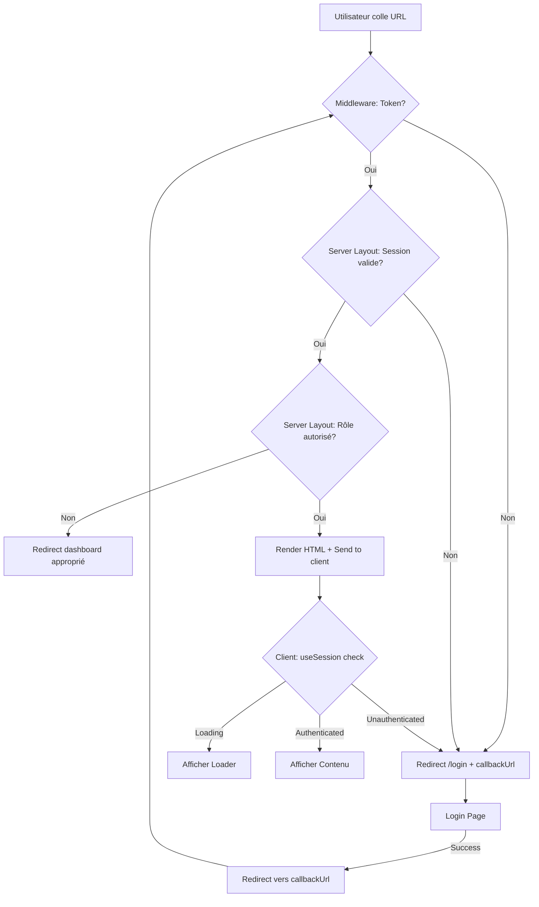

# 🔒 Système de Protection d'Authentification - Aucun Rendu Avant Vérification

## 📋 Vue d'ensemble

Ce document décrit le système de protection d'authentification mis en place pour garantir qu'**aucun contenu de l'application ne soit visible avant vérification complète de l'authentification**.

### 🎯 Objectif

**Problème résolu** : Empêcher l'affichage momentané de contenu lors du partage de liens entre navigateurs/appareils non authentifiés.

**Solution** : Protection multi-couches avec vérification côté serveur et client, bloquant tout rendu jusqu'à confirmation de l'authentification.

---

## 🏗️ Architecture du Système

### 1️⃣ **Middleware (Première ligne de défense)**

**Fichier** : `src/middleware.ts`

**Fonction** :
- Intercepte TOUTES les requêtes vers `/dashboard/*` et `/event/*`
- Vérifie la présence du token NextAuth
- Redirige immédiatement vers `/login` si pas de token
- Ajoute des headers anti-cache pour empêcher l'affichage de contenu mis en cache

**Headers anti-cache ajoutés** :
```typescript
response.headers.set('Cache-Control', 'no-store, no-cache, must-revalidate, private');
response.headers.set('Pragma', 'no-cache');
response.headers.set('Expires', '0');
```

**Avantage** :
- ✅ Bloque la requête AVANT qu'elle n'atteigne le serveur Next.js
- ✅ Redirection côté serveur (HTTP 307)
- ✅ Aucun HTML n'est envoyé au client

---

### 2️⃣ **Server Layouts (Deuxième ligne de défense)**

**Fichiers** :
- `src/app/dashboard/layout.tsx` (protection globale dashboard)
- `src/app/dashboard/user/layout.tsx` (protection pages USER)
- `src/app/dashboard/events/layout.tsx` (protection pages ORGANIZER)
- `src/app/dashboard/admin/layout.tsx` (protection pages ADMIN)
- `src/app/dashboard/analytics/layout.tsx` (protection analytics)
- `src/app/dashboard/profile/layout.tsx` (protection profil)
- `src/app/event/layout.tsx` (protection pages événements publiques)

**Fonction** :
- Vérification côté **SERVEUR** avec `getServerSession()`
- Bloque le rendu AVANT l'envoi de HTML au client
- Vérification des rôles utilisateur
- Redirection sécurisée selon les permissions

**Exemple** : `src/app/dashboard/user/layout.tsx`
```typescript
import { getServerSession } from "next-auth";
import { authOptions } from "@/lib/auth";
import { redirect } from "next/navigation";

export default async function UserDashboardLayout({ children }: { children: React.ReactNode }) {
  // Vérification côté SERVEUR (bloque tout rendu avant vérification)
  const session = await getServerSession(authOptions);
  
  // Pas de session → redirection immédiate (aucun HTML envoyé)
  if (!session) {
    redirect('/login?callbackUrl=/dashboard/user');
  }

  // Vérifier le rôle
  const userRole = session.user?.role || 'USER';
  if (userRole !== 'USER' && userRole !== 'ADMIN' && userRole !== 'ORGANIZER') {
    redirect('/dashboard');
  }

  // Autorisé → rendre le contenu
  return <>{children}</>;
}
```

**Avantage** :
- ✅ Vérification côté serveur (impossible à contourner côté client)
- ✅ Pas de "flash" de contenu non autorisé
- ✅ Aucun HTML généré si non authentifié
- ✅ Redirection automatique sécurisée

---

### 3️⃣ **Client AuthGuard (Troisième ligne de défense - optionnel)**

**Fichier** : `src/components/auth/AuthGuard.tsx`

**Fonction** :
- Composant React de protection côté client
- Utilise `useSession()` de NextAuth
- Bloque le rendu pendant la vérification
- Affiche un loader pendant l'authentification

**Utilisation** :
```typescript
import AuthGuard from "@/components/auth/AuthGuard";

export default function ProtectedPage() {
  return (
    <AuthGuard requiredRole="ADMIN" fallbackUrl="/dashboard">
      <YourPageContent />
    </AuthGuard>
  );
}
```

**Options disponibles** :
- `requiredRole` : Rôle spécifique requis ('USER' | 'ORGANIZER' | 'ADMIN' | 'STAFF')
- `allowedRoles` : Liste de rôles autorisés
- `fallbackUrl` : URL de redirection si non autorisé (défaut: '/dashboard')

**Pendant la vérification** :
```tsx
<div className="min-h-screen bg-white flex items-center justify-center">
  <div className="text-center">
    <div className="animate-spin rounded-full h-12 w-12 border-b-2 border-green-600"></div>
    <p>Vérification de vos accès...</p>
  </div>
</div>
```

**Avantage** :
- ✅ Protection côté client pour pages complexes
- ✅ Vérification des permissions granulaires
- ✅ UX claire avec loader
- ✅ Redirection automatique si non autorisé

---

## 🔐 Matrice de Protection par Route

| Route                      | Middleware | Server Layout | Rôle Requis               | Fallback          |
|---------------------------|------------|---------------|---------------------------|-------------------|
| `/dashboard`              | ✅          | ✅             | Tous authentifiés         | `/login`          |
| `/dashboard/user/*`       | ✅          | ✅             | USER, ORGANIZER, ADMIN    | `/login`          |
| `/dashboard/events/*`     | ✅          | ✅             | ORGANIZER, ADMIN          | `/dashboard/user` |
| `/dashboard/admin/*`      | ✅          | ✅             | ADMIN                     | `/dashboard`      |
| `/dashboard/analytics/*`  | ✅          | ✅             | ORGANIZER, ADMIN          | `/dashboard/user` |
| `/dashboard/profile/*`    | ✅          | ✅             | Tous authentifiés         | `/login`          |
| `/event/*`                | ✅          | ✅             | Tous authentifiés         | `/login`          |

---

## 🧪 Tests et Validation

### ✅ Scénarios de Test

#### **Test 1 : Copier-coller d'URL sans authentification**
1. **Étape** : Ouvrir un navigateur en navigation privée
2. **Action** : Coller l'URL `https://app.evenzi.io/dashboard/user/events/xyz`
3. **Résultat attendu** :
   - ❌ Aucun contenu ne doit s'afficher
   - ✅ Redirection immédiate vers `/login?callbackUrl=...`
   - ✅ Après login réussi, redirection vers l'URL demandée

#### **Test 2 : Accès cross-device**
1. **Étape** : Sur PC, copier un lien `/dashboard/analytics`
2. **Action** : Coller le lien sur mobile (non connecté)
3. **Résultat attendu** :
   - ❌ Aucun contenu ne doit s'afficher
   - ✅ Page login s'affiche immédiatement
   - ✅ Loader "Vérification..." pendant check session
   - ✅ Après login, redirection vers `/dashboard/analytics`

#### **Test 3 : Accès avec rôle non autorisé**
1. **Étape** : Connecté en tant que USER
2. **Action** : Tenter d'accéder à `/dashboard/admin`
3. **Résultat attendu** :
   - ❌ Page admin ne doit pas s'afficher
   - ✅ Redirection automatique vers `/dashboard/user`

#### **Test 4 : Cache navigateur**
1. **Étape** : Ouvrir `/dashboard/events/123` connecté
2. **Action** : Se déconnecter, puis utiliser bouton "Retour" navigateur
3. **Résultat attendu** :
   - ❌ Version mise en cache ne doit pas s'afficher
   - ✅ Headers anti-cache forcent une nouvelle vérification
   - ✅ Redirection vers login

---

## 🚀 Déploiement

### Configuration Vercel

**Variables d'environnement requises** :
```env
NEXTAUTH_URL=https://your-domain.com
NEXTAUTH_SECRET=your-secret-key
DATABASE_URL=your-database-url
```

**vercel.json** (déjà configuré) :
```json
{
  "functions": {
    "src/middleware.ts": {
      "memory": 1024,
      "maxDuration": 10
    }
  }
}
```

### Checklist de Déploiement

- [ ] Variables d'environnement configurées sur Vercel
- [ ] Middleware déployé et fonctionnel
- [ ] Server layouts testés en production
- [ ] Headers anti-cache vérifiés (DevTools > Network)
- [ ] Tests cross-device effectués
- [ ] Tests navigation privée effectués

---

## 🔍 Monitoring et Debug

### Logs à surveiller

**Middleware** :
```typescript
console.log('Authentication required', { ip: clientIP });
console.log('Destination:', destinationUrl);
console.warn('Invalid redirect URL attempted', { url });
```

**Server Layouts** :
- Pas de logs par défaut (redirection silencieuse)
- Ajouter des logs si nécessaire pour debug

**Client AuthGuard** :
```typescript
console.log('Auth status:', status);
console.log('User role:', userRole);
```

### DevTools - Vérifier Headers

Ouvrir **Network tab** et vérifier la première requête :

```
Cache-Control: no-store, no-cache, must-revalidate, private
Pragma: no-cache
Expires: 0
```

---

## 📊 Avantages du Système

### ✅ Sécurité Renforcée

1. **Protection multi-couches** : Middleware + Server + Client
2. **Impossible à contourner** : Vérifications côté serveur
3. **Aucun HTML sensible envoyé** au client non authentifié
4. **Headers anti-cache** empêchent l'affichage de contenu mis en cache

### ✅ Expérience Utilisateur

1. **Pas de "flash" de contenu** non autorisé
2. **Loader explicite** pendant vérification
3. **Redirection intelligente** vers page demandée après login
4. **Messages clairs** ("Vérification...", "Redirection...")

### ✅ Performance

1. **Redirection HTTP 307** (rapide, côté serveur)
2. **Pas de rendu inutile** si non authentifié
3. **Cache désactivé** pour routes protégées (sécurité > performance)

---

## 🔄 Flux Complet d'Authentification



---

## 🛡️ Sécurité Additionnelle

### Validation d'URL

**Fichier** : `src/lib/redirectValidation.ts`

**Fonctions** :
- `isValidRedirectUrl(url)` : Vérifie que l'URL est valide et sécurisée
- `sanitizeRedirectUrl(url)` : Nettoie l'URL avant redirection
- `canUserAccessUrl(url, role)` : Vérifie les permissions par rôle
- `getFinalRedirectUrl(url, role)` : Détermine l'URL finale sécurisée

**Protection contre** :
- ✅ Open redirect attacks
- ✅ URLs externes malveillantes
- ✅ Accès à des routes non autorisées par rôle

---

## 📚 Ressources

### Documentation NextAuth
- [Server-side Session](https://next-auth.js.org/configuration/nextjs#getServerSession)
- [Middleware](https://next-auth.js.org/configuration/nextjs#middleware)

### Documentation Next.js
- [Middleware](https://nextjs.org/docs/app/building-your-application/routing/middleware)
- [Server Components](https://nextjs.org/docs/app/building-your-application/rendering/server-components)
- [Redirect](https://nextjs.org/docs/app/api-reference/functions/redirect)

---

## 🎯 Conclusion

Le système de protection d'authentification est maintenant **complet et multi-couches** :

1. ✅ **Middleware** : Première barrière, bloque les requêtes non authentifiées
2. ✅ **Server Layouts** : Seconde barrière, empêche le rendu HTML
3. ✅ **Client AuthGuard** : Troisième barrière optionnelle, vérification granulaire
4. ✅ **Headers anti-cache** : Empêche l'affichage de contenu mis en cache
5. ✅ **Validation d'URL** : Protection contre les attaques par redirection

**Résultat** : **Zéro affichage de contenu avant authentification confirmée** ✅

---

**Créé le** : 9 novembre 2025  
**Dernière mise à jour** : 9 novembre 2025  
**Version** : 1.0.0

